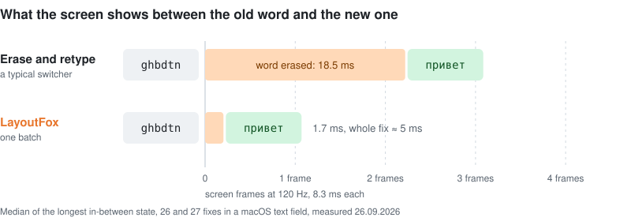

  

<h1 align="center">LayoutFox</h1>

  An automatic Russian/English keyboard layout switcher for Windows and macOS. 
  You type <code>ghbdtn</code>, the screen shows <code>привет</code>. Usually before you finish the word.

  <a href="https://github.com/danzerzine/LayoutFox-releases/releases/latest/download/LayoutFox-mac.zip"><b>Download for macOS</b></a>
  &nbsp;·&nbsp;
  <a href="https://github.com/danzerzine/LayoutFox-releases/releases/latest/download/LayoutFox.exe"><b>Download for Windows</b></a>
  &nbsp;·&nbsp;
  <a href="README.md">Русский</a>

---

## The numbers

| What | Result |
|---|---|
| Breaks a correctly typed word | 4 times in 2,976 words (0.13%), rare words only; never in real chat phrases |
| Misses a word typed in the wrong layout | 68 of 2,180 (3.1%) |
| Fixes the word while you are still typing it | 79% of fixes, at the 3rd letter on average |
| The word disappears during a fix | 1.7 ms, against 18.5 ms for a switcher that erases and retypes |
| Torn frames in Chrome, Telegram, VS Code | 0 in 63 fixes |
| Time spent on a key press | 0.06 ms on Windows, about 0.5 ms on the Mac |
| Sends what you type to the internet | never |

The numbers come from a 5,156-word bench and from measurements taken on 26.09.2026. How they were measured is below.

## Fixes that don't flicker

Most switchers fix a word in three steps: erase it with Backspace one letter at a time, pause, type it again. The screen catches the moments in between and shows an empty spot or half a word, and the line visibly jumps.

LayoutFox sends the erase and the new word as one batch of key events. We logged every change of the text in a macOS text field over 26–27 fixes in a row:

  

| | A typical switcher | LayoutFox |
|---|---|---|
| Longest in-between state (median) | 18.5 ms, up to 32.5 ms | 1.7 ms |
| An in-between state lasting over one 120 Hz frame | in 25 of 26 fixes | in 2 of 27 |
| The whole fix | 11–32 ms of pause alone | about 5 ms |

Chromium apps (Chrome, Claude, Telegram Desktop, VS Code) are harder. Chromium paints a frame right after the first event of a burst, however quickly the rest follow, so even a fast letter-by-letter erase tears a frame in 5–20 of 21 fixes. There the Mac app selects the old word through Accessibility, checks that the selection holds exactly that word and types the new one over it in a single event. The result is 0 torn frames in 63 fixes, about 0.9 ms each.

On Windows the whole fix also reaches the system as one batch.

## How it tells a word is in the wrong layout

LayoutFox stores each letter as the key that was pressed, so every word has two readings, Russian and English. It decides in two steps.

**Mid-word.** From the third letter on, it compares how often words start with each reading (frequencies from [wordfreq](https://github.com/rspeer/wordfreq)). It switches only when the other start is 1000 times more common. The threshold was tuned on 22,000 real words and made no mistake among the 5,000 most frequent words of either language. When in doubt, it waits for the end of the word.

**At the end of the word** (Space, Enter, Tab) dictionaries and context decide:

- The system's own spell checker, no dictionaries to download.
- Word frequencies when both readings are real words: `ult` occurs 708 times per billion words, `где` 1.2 million times, so it switches.
- Neighbouring words: `d ljvt` → `в доме`, `f ult` → `а где`.
- Typos: a wrong-layout word with one typo still gets fixed, while your own typo in the right layout is left alone.
- Number-row punctuation converts with the word: `rfr&` → `как?`, `lf!` → `да!`.
- Code stays untouched: `README.md`, `snake_case`, `camelCase`, `x86`.
- The last word of a line is fixed before Enter goes through, so a chat message is sent already corrected.

The ground rule: breaking a correct word is 5 times worse than missing a wrong one. A miss takes one double Shift to fix; a broken word is the one that annoys. The bench penalty follows this rule, and so does every change we accept.

## It learns from you, carefully

- **Backspace right after a fix** puts the word back. Undo the same fix twice and LayoutFox remembers not to make it again.
- **Double Shift** undoes a fresh fix, converts the current or last word, or just switches the layout when there is no word. On the Mac it converts selected text too: `Ghbdtn? rfr ltkf&` → `Привет, как дела?`.
- **Your own words.** Dictionaries don't know slang, brand names or model names like "Qwen". Type such a word correctly twice and keep writing, and it becomes known; from then on its wrong-layout version gets fixed.
- **Exceptions.** An app where fixing gets in the way can be excluded right from the menu.

## Privacy

- What you type never leaves your computer. The only network request is an update check on GitHub every six hours.
- Your own words are stored as 64-bit hashes, not as text.
- While a password field is open, LayoutFox fixes and remembers nothing (macOS).
- The debug log is off by default.

## How it is tested

- **The bench** has 5,156 words: phrases from real chats (slang, tech talk, commands, mixed Russian and English) and wordfreq words from common to rare, each typed in the right and in the wrong layout. On top of that come 914 trap words (brands, abbreviations, code) and every misfire seen in real use. A rule is accepted only if the penalty goes down.
- **The key test** runs the real system keyboard hook with real key presses into its own window, Chrome and TextEdit.
- A misfire found in real use becomes a test for good: there are 10 of them now, and all pass.

| Bench, 26.09.2026 | Words | Broken | Missed |
|---|---:|---:|---:|
| Chat: everyday, tech, slang, code | 1,556 | 0 | 22 |
| Common words (top 2,000) | 1,200 | 0 | 1 |
| Mid-frequency words | 1,200 | 0 | 9 |
| Rare words | 1,200 | 4 | 36 |
| Traps | 914 | 0 | 16 |

## Install

**macOS 14 or later.** Download [`LayoutFox-mac.zip`](https://github.com/danzerzine/LayoutFox-releases/releases/latest/download/LayoutFox-mac.zip), unzip it and move LayoutFox.app to Applications. The app is signed with its own certificate rather than Apple's, so macOS won't open it the first time: go to System Settings → Privacy & Security and click "Open Anyway". Then grant Accessibility access; the app shows where.

**Windows.** Needs the [.NET 8 Desktop Runtime](https://dotnet.microsoft.com/download/dotnet/8.0) (x64). Download [`LayoutFox.exe`](https://github.com/danzerzine/LayoutFox-releases/releases/latest/download/LayoutFox.exe) and put it in any folder you can write to (not Program Files), or updates won't be able to replace it. It also handles keys that arrive through Parsec from another computer, which many switchers don't see.

The app updates itself: it downloads a new version, checks it against `SHA256SUMS` and asks before installing.

| | Windows | macOS |
|---|---|---|
| Size | exe 4.1 MB | zip 4.5 MB |
| Memory | 32 MB | 45 MB |

The interface is in Russian.

---

Word frequencies: [wordfreq](https://github.com/rspeer/wordfreq), CC BY-SA 4.0. The source code is private; this repository holds the ready builds only.
