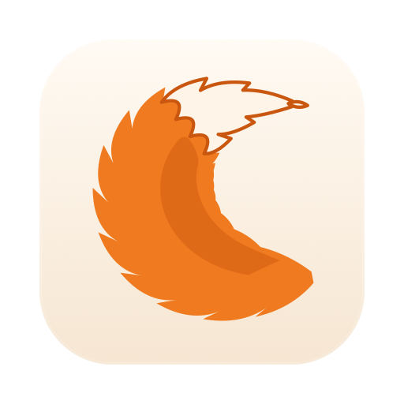
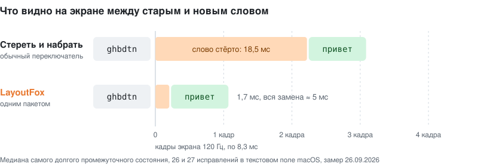

  

<h1 align="center">LayoutFox</h1>

  Автоматический переключатель раскладки клавиатуры RU/EN для macOS и Windows, альтернатива Punto Switcher и Caramba. 
  Набрали <code>ghbdtn</code>, на экране <code>привет</code>. Обычно ещё до конца слова.

  <a href="https://github.com/danzerzine/LayoutFox-releases/releases/latest/download/LayoutFox-mac.zip"><b>Скачать для macOS</b></a>
  &nbsp;·&nbsp;
  <a href="https://github.com/danzerzine/LayoutFox-releases/releases/latest/download/LayoutFox.exe"><b>Скачать для Windows</b></a>
  &nbsp;·&nbsp;
  <a href="CHANGELOG.md">Что нового</a>
  &nbsp;·&nbsp;
  <a href="README.en.md">English</a>

---

## Коротко в цифрах

| Что | Результат |
|---|---|
| Портит правильное слово | 3 раза на 2 975 слов (0,1%), только на редких словах; в живых фразах из чата ни разу |
| Пропускает слово в чужой раскладке | 58 из 2 181 (2,7%) |
| Исправляет прямо посреди слова | 77% исправлений, в среднем на 3-й букве |
| Слово пропадает с экрана при замене | 1,7 мс против 18,5 мс у переключателя, который стирает и набирает заново |
| Рваные кадры в Chrome, Telegram, VS Code | 0 из 63 замен |
| Думает над нажатием | 0,06 мс на Windows, около 0,5 мс на Mac |
| Отправляет ваш текст в интернет | никогда |

Цифры взяты из бенча на 5 156 словах и замеров от 26.09.2026. Как они получены, написано ниже.

## Замена без дёрганья

Большинство переключателей исправляют слово так: стирают его по букве через Backspace, делают паузу и набирают заново. Между этими шагами экран успевает показать пустое место или полслова. Глаз это замечает: строка дёргается.

LayoutFox отправляет стирание и новое слово одним пакетом нажатий. Мы записали каждое изменение текста в поле macOS на 26–27 исправлениях подряд:

  

| | Обычный переключатель | LayoutFox |
|---|---|---|
| Самое долгое промежуточное состояние (медиана) | 18,5 мс, до 32,5 мс | 1,7 мс |
| Промежуточное состояние дольше одного кадра 120 Гц | в 25 заменах из 26 | в 2 из 27 |
| Вся замена целиком | 11–32 мс только на паузу | около 5 мс |

С программами на Chromium (Chrome, Claude, Telegram Desktop, VS Code) сложнее. Chromium рисует кадр сразу после первого события в пачке, как бы быстро ни шли следующие, поэтому даже быстрое стирание по буквам рвёт кадр в 5–20 заменах из 21. На Mac LayoutFox там выделяет старое слово через Accessibility, сверяет, что выделено именно оно, и печатает новое поверх одним событием. Результат: 0 рваных кадров в 63 заменах, на каждую около 0,9 мс.

На Windows вся замена тоже уходит в систему одним пакетом.

## Как он понимает, что слово не в той раскладке

Каждая буква хранится как нажатая клавиша, поэтому у слова всегда два прочтения, русское и английское. Решение принимается в два этапа.

**Посреди слова.** С третьей буквы LayoutFox сравнивает, как часто слова начинаются с каждого из прочтений (частоты взяты из [wordfreq](https://github.com/rspeer/wordfreq)). Переключает, только если другое начало встречается в 1000 раз чаще. Порог подобран на 22 000 реальных слов: среди 5 000 самых частых слов каждого языка он не ошибся ни разу. Если сомневается, ждёт конца слова.

**В конце слова** (пробел, Enter, Tab) решают словари и контекст:

- Проверка орфографии самой системы, без скачиваемых словарей.
- Частоты слов, когда оба прочтения существуют: `ult` встречается 708 раз на миллиард слов, `где` 1,2 млн раз, значит переключаем.
- Соседние слова: `d ljvt` → `в доме`, `f ult` → `а где`.
- Опечатки: слово в чужой раскладке с одной опечаткой всё равно исправится, а вашу опечатку в правильной раскладке он не тронет.
- Знаки на цифровом ряду переводятся вместе со словом: `rfr&` → `как?`, `lf!` → `да!`.
- Код не трогает: `README.md`, `snake_case`, `camelCase`, `x86` остаются как есть.
- Последнее слово строки успевает исправиться до Enter, так что сообщение в чат уходит уже правильным.

Главное правило: испорченное правильное слово в 5 раз хуже пропущенного. Пропуск вы поправите двойным Shift, а испорченное слово раздражает. По этому правилу считается штраф в бенче и принимается каждое изменение.

## Учится у вас, осторожно

- **Backspace сразу после исправления** возвращает слово как было. Если вы отменили одно и то же исправление дважды, LayoutFox его запоминает и больше так не делает.
- **Двойной Shift** отменяет свежее исправление, переводит текущее или последнее слово, а без слова просто меняет раскладку. На Mac он переводит и выделенный текст: `Ghbdtn? rfr ltkf&` → `Привет, как дела?`.
- **Свои слова.** Словари не знают «чекни», «кст» или «Qwen». Если вы дважды набрали такое слово правильно и продолжили писать, оно становится известным, и `xtryb` дальше исправится на `чекни`.
- **Исключения.** Программу, где исправлять не надо, можно добавить прямо из меню.

## Приватность

- Набранный текст не покидает компьютер. Единственное обращение в сеть: раз в шесть часов проверить на GitHub, нет ли новой версии.
- Свои слова хранятся как 64-битные хеши, а не текстом.
- Пока открыто поле пароля, LayoutFox ничего не исправляет и не запоминает (macOS).
- Журнал отладки выключен по умолчанию.

## Как проверяется

- **Бенч** из 5 156 слов: фразы из живого чата (сленг, техника, команды, смешанный текст) и слова wordfreq от частых до редких, каждое набрано в правильной и в неправильной раскладке. Отдельно 1 106 слов-ловушек (бренды, аббревиатуры, код) и каждая ошибка, замеченная в жизни. Правило принимается, только если штраф падает.
- **Тест клавиш** гоняет настоящий системный перехват клавиатуры и настоящие нажатия в окне, Chrome и TextEdit.
- Ошибка, найденная вживую, становится тестом навсегда: сейчас их 15, и все проходят.

| Бенч, 02.10.2026, Mac | Слов | Испорчено | Пропущено |
|---|---:|---:|---:|
| Чат: обычный, техника, сленг, код | 1 556 | 0 | 13 |
| Частые слова (топ-2 000) | 1 200 | 0 | 1 |
| Средние слова | 1 200 | 0 | 9 |
| Редкие слова | 1 200 | 3 | 35 |
| Ловушки | 1 106 | 0 | 12 |

## Частые вопросы

**Есть ли Punto Switcher для Mac?** LayoutFox делает то же самое на macOS 14 и новее (Mac с M1 и новее): сам исправляет слово, набранное не в той раскладке, а двойной Shift переводит слово или выделенный текст. Версии для Mac и Windows используют одно ядро и одинаково решают, что исправлять.

**Работает ли через Parsec и удалённый рабочий стол?** Да, с Parsec и с RDP (с Mac через Windows App). LayoutFox на Windows видит нажатия, которые Parsec присылает с другого компьютера, а многие переключатели их пропускают: из-за этого LayoutFox и появился. Если на Mac тоже стоит LayoutFox, в окнах Parsec и Windows App он молчит сам, и слово не исправляется дважды. Режим «Работает только для Parsec» на Windows нажатия из RDP пропускает: RDP присылает их как обычная клавиатура. Другие клиенты удалённого доступа мы не проверяли; для них добавьте клиент в исключения на своём Mac.

**Чем отличается от Caramba и других переключателей?** Замена почти не дёргает строку (цифры выше), правильное слово портится редко (0,1% на бенче), а ваш текст никуда не уходит. Решения проверяются на бенче из 5 156 слов, а каждая ошибка, замеченная в жизни, становится тестом.

## Установка

**macOS 14 и новее, Mac на Apple Silicon (M1 и новее).** Скачайте [`LayoutFox-mac.zip`](https://github.com/danzerzine/LayoutFox-releases/releases/latest/download/LayoutFox-mac.zip), распакуйте и перенесите LayoutFox.app в «Программы». С Homebrew то же самое делает одна команда: `brew install --cask danzerzine/tap/layoutfox`. Приложение подписано собственным сертификатом, а не Apple, поэтому при первом запуске macOS его не откроет: зайдите в «Системные настройки → Конфиденциальность и безопасность» и нажмите «Всё равно открыть». Потом дайте доступ в «Универсальном доступе», окно само подскажет, где это.

**Windows.** Нужен [.NET 8 Desktop Runtime](https://dotnet.microsoft.com/download/dotnet/8.0) (x64). Скачайте [`LayoutFox.exe`](https://github.com/danzerzine/LayoutFox-releases/releases/latest/download/LayoutFox.exe) и положите в любую папку, где у вас есть право записи (не в Program Files), иначе обновление не сможет его заменить. Программа не подписана, поэтому при первом запуске Windows может показать синее окно «Windows защитила ваш компьютер»: нажмите «Подробнее», потом «Выполнить в любом случае». Работает и с клавиатурой, которая приходит через Parsec с другого компьютера: многие переключатели такие нажатия не видят.

Обновления программа ставит сама: скачивает новую версию, сверяет её контрольную сумму из `SHA256SUMS` и спрашивает, ставить ли. Что изменилось в каждой версии, написано в [CHANGELOG.md](CHANGELOG.md).

| | Windows | macOS |
|---|---|---|
| Размер | exe 4,1 МБ | zip 4,5 МБ |
| Память | 32 МБ | 45 МБ |

---

Частоты слов: [wordfreq](https://github.com/rspeer/wordfreq), лицензия CC BY-SA 4.0. Код программы закрыт, здесь лежат только готовые сборки.
